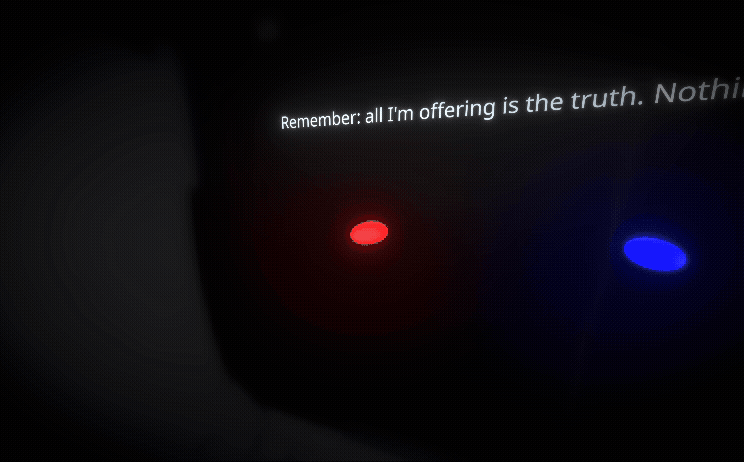

<h1 align="center">@react-three/timeline</h1>
<h3 align="center">Write composable declarative <br/> 3D behaviors like a story.</h3>
<br/>

<p align="center">
  <a href="https://npmjs.com/package/@react-three/timeline" target="_blank">
    
  </a>
  <a href="https://npmjs.com/package/@react-three/timeline" target="_blank">
    
  </a>
  <a href="https://twitter.com/pmndrs" target="_blank">
    
  </a>
  <a href="https://discord.gg/ZZjjNvJ" target="_blank">
    
  </a>
</p>

```bash
npm install three @react-three/fiber @react-three/timeline
```


### What does it look like?

| A simple timeline with 2 actions (look at red pill and look at blue pill) with an infinite loop |  |
| --------------------------------------------------------------------------------------------------------------------------------------------------- | --------------------------------------------------------------------- |

```tsx
const camera = useThree((s) => s.camera)
const redPill = useRef<Mesh>(null)
const bluePill = useRef<Mesh>(null)

useTimeline(async function* () {
  while (true) {
    //transition to look at the red pill
    yield* action({ update: lookAt(camera, redPill.current!, spring()) })
    //transition to look at the blue pill
    yield* action({ update: lookAt(camera, bluePill.current!, spring()) })
  }
}, [])

return (
  <>
    <Text position-y={1} scale={0.3}>
      Remember: all I'm offering is the truth. Nothing more.
    </Text>
    <mesh position-y={-1} position-x={-2} rotation-y={(-30 / 180) * Math.PI} scale={0.2} scale-z={0.4} ref={redPill}>
      <sphereGeometry />
      <meshPhysicalMaterial emissive="red" emissiveIntensity={0.5} color="red" />
    </mesh>
    <mesh position-y={-1} position-x={2} rotation-y={(20 / 180) * Math.PI} scale={0.2} scale-z={0.4} ref={bluePill}>
      <sphereGeometry />
      <meshPhysicalMaterial emissive="blue" emissiveIntensity={5} color="blue" />
    </mesh>
  </>
)
```

## Documentation

- [What is a timeline?](https://pmndrs.github.io/timeline/getting-started/1-what-is-a-timeline)
- [Building your First Timeline](https://pmndrs.github.io/timeline/getting-started/2-first-timeline)
- [Overview over All Functions](https://pmndrs.github.io/timeline/getting-started/3-overview)
- [Tutorial: Building Complex Timelines using Parallel](https://pmndrs.github.io/timeline/tutorial/4-parallel)
- [Tutorial: Building Graph Timelines](https://pmndrs.github.io/timeline/tutorial/5-graph)
- [Tutorial: Use pmndrs/timeline in vanilla three.js](https://pmndrs.github.io/timeline/tutorial/6-vanilla)

## Sponsors

This project is supported by a few companies and individuals building cutting edge 3D Web & XR experiences. Check them out!


## Roadmap

[ ] record, useRecordedTimeline, ... => allows to bind the timeline progress to any controls (e.g. scrolling); allowing using markers to attach scroll positions (e.g. button center screen) to the time of the timeline  
[ ] yield* cleanup(() => ...)  
[ ] add external methods for the graph (set/get state externally)  
[ ] queue with optional priority sorting and cancelation (configure what happens whith the current timeline when canceled)  
[ ] timeline visualization and `yield* marker(...)` to appear in the visualization (e.g. log values or complete json objects)
